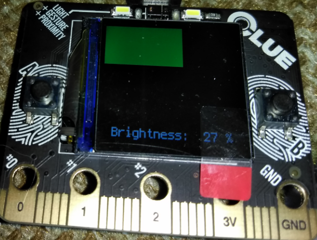
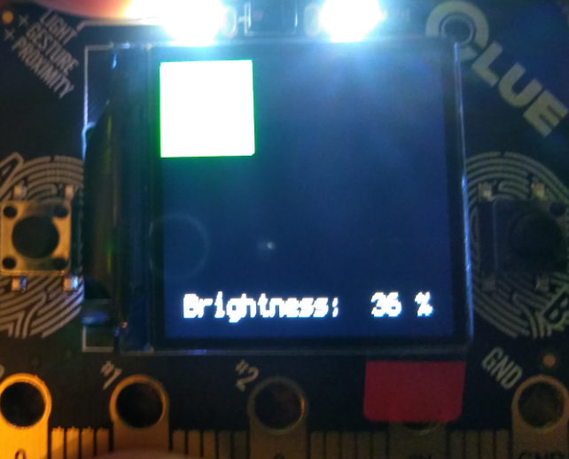

This example turns your CLUE into device sort of like [Dumbledore's Deluminator](https://harrypotter.fandom.com/wiki/Deluminator)

Hold the A button and charge the Deluminator by absorbing light from a light source.
Brighter light sources increase brightness of light emitted when you discharge. 

**\*Our Deluminator will absorb some of the light's essence, but Circuit Python 
not quite as powerful as Dumbledore (yet!) so it won't capture the light entirely 
like his does.**

After you've charged it up some:

 - Press the B button to enable discharge mode and emit light from the two white LEDs. While discharging the charge_level will go down.
 - Press the B button again to turn off the light. 

Charge Level is depicted with a green progress bar at the top of the screen.

Brightness is shown as text at the bottom of the screen. 

